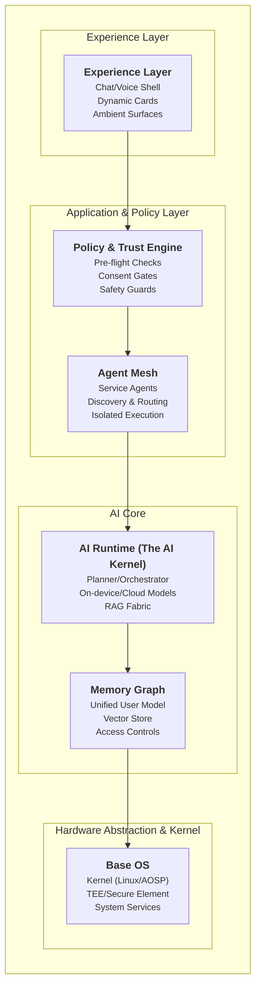

# AI-First OS Architecture

This document outlines the architecture of the AI-First OS, based on the provided blueprint. It describes the core principles, system layers, and key models for security and execution.

## 1. Core Principles

- **Agent-centric, not app-centric**: The user makes a request; the OS plans the task, calls the necessary "agents" (service adapters), and returns the results. The concept of standalone, user-managed apps is replaced by a mesh of on-demand capabilities.
- **Local-first, cloud-assist**: The OS prioritizes on-device processing for speed, privacy, and offline functionality. It escalates to cloud services for heavy-duty reasoning or when required by an agent, but always in a secure manner.
- **Memory is a platform**: A persistent, permissioned "memory graph" of user context (entities, preferences, habits) is the foundation for deep personalization across all experiences.
- **Safety by construction**: Every action and data access is gated by a strict policy and consent engine, ensuring that the OS operates within user-defined boundaries.

## 2. System Architecture (Layers)

The OS is designed as a series of distinct layers, from the low-level kernel to the user-facing experience.

## 3. Security & Privacy Model

- **Identity**: Device-bound keys, passkeys, and biometrics form the root of trust. Agents are authenticated via per-service OAuth.
- **Secrets**: A hardware-backed vault (using the TEE/SE) manages sensitive data like keys and payment tokens. Access is granted with least-privileged, scoped tokens.
- **Permissioning**: The system uses granular scopes (e.g., `calendar.read`, `payment.charge:$300/day`) and prompts the user for consent just-in-time.
- **Auditability**: An append-only log of all system actions provides a transparent, user-readable trace to answer "Why did you do X?".
- **Hardening**: The attack surface is minimized through a prompt-injection firewall, content sandboxing, URL allow-lists, and SSRF guards.

## 4. On-device vs. Cloud

The OS uses a tiered execution model to balance latency, cost, and privacy.

- **Budget**: Strict performance budgets are enforced (e.g., P95 end-to-end latency < 2.5s).
- **Tiering**: The system first attempts to fulfill an intent on-device. It falls back to the cloud for more complex reasoning and degrades gracefully if offline.
- **Caching**: Semantic and tool-result caches are used to speed up common requests and reduce redundant computations.
